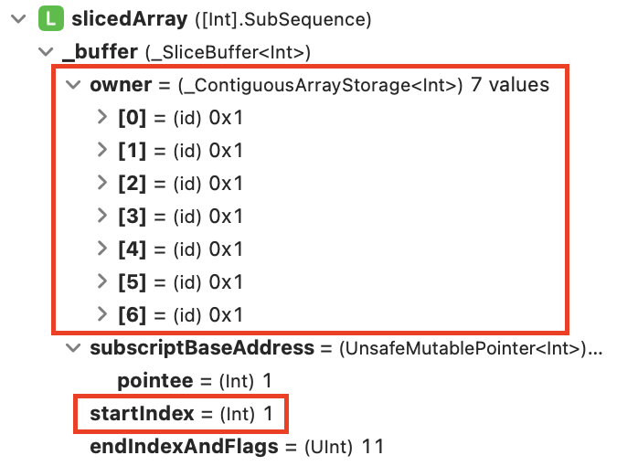

## 1. 문제

`프로그래머스`

[고득점 Kit K번째수](https://school.programmers.co.kr/learn/courses/30/lessons/42748)


<br/>

## 2. 핵심 아이디어

`정렬` `문자열 슬라이싱`

<br/>

## 3. 코드
[swift]
```swift
import Foundation

func solution(_ array:[Int], _ commands:[[Int]]) -> [Int] {
    var answer: [Int] = []
    for command in commands {
        let slicedArray = array[command[0] - 1...command[1] - 1]
        let sortedSlicedArray = slicedArray.sorted(by: < )
        let element = sortedSlicedArray[command[2] - 1]
        answer.append(element)
    }
    
    return answer
}

```

<br/>

## 4. 풀이 과정

문제에서 요구하는대로 코드의 플로우를 다음과 같이 생각했다.

1. commands 1,2 로 배열 슬라이싱
2. 슬라이싱한 배열을 정렬
3. commands 3 번쨰 원소 정답 배열에 추가
-> 반복

그대로 구현해서 풀었는데, 푸는 과정에서 `SubSequence`에 대한 이해를 잘 몰라서 오류가 발생했었다.

```swift
let slicedArray = array[command[0] - 1...command[1] - 1]
slicedArray.sort(by: < )
let element = slicedArray[command[2] - 1]
```

이 코드로 처음에 배열을 곧바로 정렬을 해서 인덱싱을 해줬는데, index out of range 오류가 발생했다. 이유는 즉슨 slicedArray 의 **index 값이 새로만들어 지지 않기** 때문이다.

왜냐하면 `SubSequence` 는 배열을 새로 만들어 내는게 아니라, 참조해서 만들어지기 때문이다. 또한 원래 배열의 indices 를 공유한다.

-> 기존 배열의 idnex 값들이 유지가 됨.




그래서 새롭게 배열을 만들어내는 sorted 는 index 오류가 없었고, sort 는 index 오류가 발생했다.

때문에 그대로 배열을 유지한채로 indexing 을 하기위해서는 아래 코드와 같이 index 를 start index 만큼 더해줘서 원본 배열의 index 로 SubSequence index를 새로 맞추는 작업이 필요하다.

```swift
func solution(_ array:[Int], _ commands:[[Int]]) -> [Int] {
    var answer: [Int] = []
    for command in commands {
        var slicedArray = array[command[0] - 1...command[1] - 1]
        slicedArray.sort(by: <)
        let bufferIndex = slicedArray.index(command[2] - 1, offsetBy: slicedArray.startIndex)
        // changed
        let element = slicedArray[bufferIndex]
        answer.append(element)
    }
    
    return answer
}
```


<br/>

## 5. 다른 사람의 코드

```swift
import Foundation

    func solution(_ array:[Int], _ commands:[[Int]]) -> [Int] {
        return commands.map({(key) in
            return array[(key[0]-1)...(key[1]-1)].sorted()[key[2]-1]
        })

    }
```

깔끔하게 map을 사용하여 문제를 풀었다! 

map 잘쓰면 멋있는듯.

<br/>


```toc

```
