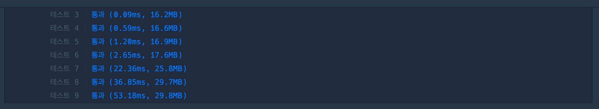

## 1. 문제

`프로그래머스`

[고득점 Kit 가장 먼 노드](https://school.programmers.co.kr/learn/courses/30/lessons/49189?language=swift)


<br/>

## 2. 핵심 아이디어

`DFS`

<br/>

## 3. 코드

```swift
import Foundation

func solution(_ n:Int, _ edge:[[Int]]) -> Int {
    var graph = Array(repeating: [Int](), count: n + 1)
    var isVisited = Array(repeating: false, count: n + 1)
    edge.forEach{ graph[$0[0]].append($0[1]);graph[$0[1]].append($0[0]) }
    
    var currentNodes:Set = [1]
    var nodeCnt = 0
    while !currentNodes.isEmpty {
        var nodes = Set<Int>()
        var isStepIn = false
        currentNodes.forEach{ isVisited[$0] = true }
        for node in currentNodes {
            for number in graph[node] {
                if !isVisited[number] {
                    if !isStepIn {
                        isStepIn = true
                        nodeCnt = 0
                    }
                    isVisited[number] = true
                    nodes.insert(number)
                    nodeCnt += 1
                }
            }
        }
        currentNodes = nodes
    }
    return nodeCnt
}
```

<br/>

## 4. 풀이 과정

가장 멀리있는 노드가 몇개인지 구하는 문제인데, 처음에는 쉽다고 생각했다.

우선 처음에 문제를 풀떄 연결된 점을 그래프로 만들어 BFS로 탐색하려고 했다.

<br/>

```swift
func solution(_ n:Int, _ edge:[[Int]]) -> Int {
    // 간선을 따라 탐색 (BFS)
    var graph = Array(repeating: Array(repeating: 0, count: n + 1), count: n + 1)
    var isVisited = Array(repeating: false, count: n + 1)
    for i in 0..<edge.count {
        let e = edge[i]
        graph[e[0]][e[1]] = 1
        graph[e[1]][e[0]] = 1
    }
    var farNodeDepth = 0
    var farNodeCnt = 0
    var queue: [(Int, Int)] = []
    queue.append((1,0))
    isVisited[1] = true
    while !queue.isEmpty {
        let (num, depth) = queue.removeFirst()
        if farNodeDepth < depth {
            farNodeDepth = depth
            farNodeCnt = 1
        } else {
            farNodeCnt += 1
        }
        for i in 1...n {
            if !isVisited[i] && graph[num][i] == 1 {
                isVisited[i] = true
                queue.append((i, depth + 1))
            }
        }
    }
    return farNodeCnt
}
```

<br/>

하지만 이렇게 풀면 graph 자체가 매우 클때 graph 하나의 라인을 n 만큼 계속 반복해줘야하기 떄문에 시간 복잡도가 커져서 문제에 통과할 수 없다.

<br/>

해답은 그래프를 연결된 간선으로만 만들어서 탐색하는 것이였다.

해당 풀이는 [이곳](https://fomaios.tistory.com/entry/Swift-프로그래머스-가장-먼-노드)을 참고하였다.

<br/>

그런데 이 풀이에서는 중복값을 제거하기위해 Node를 담는 배열에 Set을 사용하였다 했는데, 사실은 isVisited 배열이 중복을 체킹해주고 있어서 중복값이 들어갈일은 없다.

다만 시간초에서 유의미한 차이가 발생해서 Set 과 Array의 iteration 속도를 한번 실험으로 측정해볼생각이다. (업데이트 예정)

<br/>

|<center>[Set]()<center/>|<center>[Array]()<center/>|
| :---: | ---: |
|||

<br/>

(Node를 담는 배열을 각각 Set과 Array로 했을 때 시간차이)


<br/>

## 5. 다른 사람의 코드

```swift

```

<br/>


```toc

```
