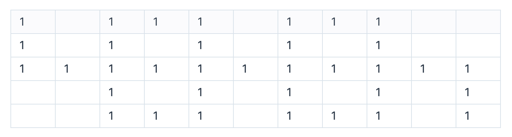

## 1. 문제

`프로그래머스`

[고득점 Kit 게임 맵 최단거리](https://school.programmers.co.kr/learn/courses/30/lessons/1844)


<br/>

## 2. 핵심 아이디어

`BFS`

<br/>

## 3. 코드

[swift]
```swift
import Foundation

func solution(_ maps: [[Int]]) -> Int {
    var maps = maps
    let n = maps[0].count
    let m = maps.count
    let dx: [Int] = [0,0,-1,1]
    let dy: [Int] = [1,-1,0,0]
    var queue: [(Int, Int)] = []
    queue.append((0,0))
    maps[0][0] = 1
    while !queue.isEmpty {
        let element = queue.removeFirst()
        let x = element.0
        let y = element.1
        for i in 0...3 {
            let dx = x + dx[i]
            let dy = y + dy[i]
            if dx >= 0 && dx < n && dy >= 0 && dy < m {
                if maps[dy][dx] == 0 {
                    continue
                }
                if maps[dy][dx] == 1 {
                    maps[dy][dx] = maps[y][x] + 1
                    queue.append((dx,dy))
                }
            }
        }
    }
    return maps[maps.endIndex - 1][maps.endIndex - 1] == 1 ? -1 : maps[maps.endIndex - 1][maps.endIndex - 1]
}
```

[python]
```python
from collections import deque

def solution(maps):
    n = len(maps[0])
    m = len(maps)
    direction = [(0,1), (0,-1), (1,0), (-1,0)]
    dq = deque()
    dq.append((0,0))
    maps[0][0] = 1
    while dq:
        x,y = dq.popleft()
        for direct in direction:
            dx = x + direct[0]
            dy = y + direct[1]
            if 0 <= dx < n and 0 <= dy < m:
                if maps[dy][dx] == 0:
                    continue
                if maps[dy][dx] == 1:
                    maps[dy][dx] = maps[y][x] + 1
                    dq.append((dx,dy))
    return maps[-1][-1] if maps[-1][-1] != 1 else -1
```

<br/>

## 4. 풀이 과정

흔히 보던 BFS/DFS 탐색 문제였다!

`BFS`로 아직 탐색하지 않은 경로 (maps[dx][dy] == 1 인 경우) 와 벽을 피해주면서 탐색하면 되었다.

그렇게 쉽게 문제를 푼 다음, DFS로도 문제를 풀어보려 했었는데...

`DFS` 로는 문제가 풀리지 않았다.

<br/>

[python]
```python
def solution(maps):
    n = len(maps[0])
    m = len(maps)
    direction = [(0,1), (0,-1), (1,0), (-1,0)]
    def DFS(x,y):
        if x == n - 1 and y == m - 1:
            return
        for direct in direction:
            dx = x + direct[0]
            dy = y + direct[1]
            if 0 <= dx < n and 0 <= dy < m:
                if maps[dy][dx] == 0:
                    continue
                if maps[dy][dx] == 1 or maps[y][x] + 1 < maps[dy][dx]:
                    maps[dy][dx] = maps[y][x] + 1
                    DFS(dx,dy)
    DFS(0,0)
    return maps[-1][-1] if maps[-1][-1] != 1 else -1
```

이 DFS 코드가 실패하는 이유는 탐색하는 경로가 너무나 많아지기 때문이다.

<br/>



이런 형태의 맵이 있다고 가정한다면,

DFS는 교차로 (위, 오른쪽, 아래쪽) 를 모두 3^n * k (n는 삼거리의 개수, k는 삼거리의 경로 개수) 연산으로 탐색을 해야하기 때문에... 시간복잡도가 망하는 것이였다.

<br/>

이처럼 문제에서 최단 거리를 제공한다면 (마지막 종착지가 정해져있고 가중치가 없음) BFS가 확실히 좋은 선택이다 라고 느꼈다.

<br/>


```toc

```
