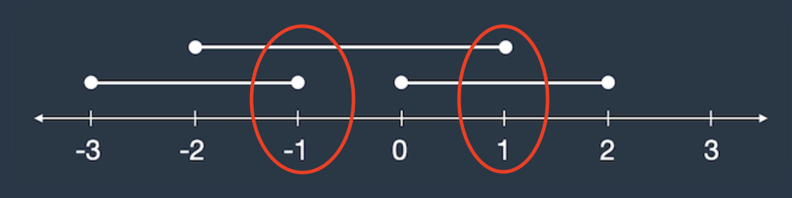
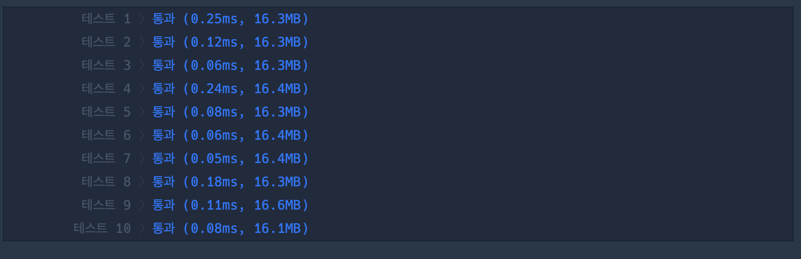
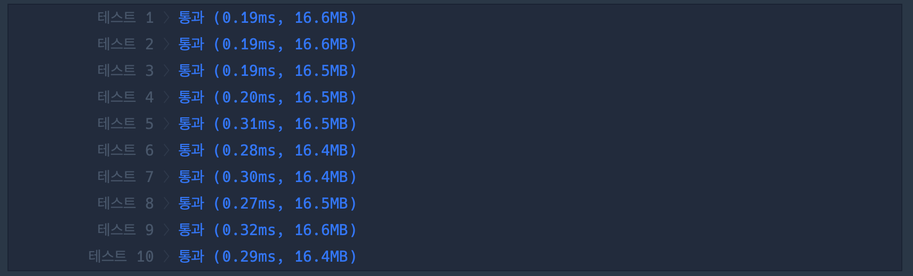

## 1. 문제

`프로그래머스`

[고득점 Kit 겹치는 선분의 길이](https://school.programmers.co.kr/learn/courses/30/lessons/120876)


<br/>

## 2. 핵심 아이디어

`그리디`

<br/>

## 3. 코드

```swift
import Foundation

func solution(_ lines:[[Int]]) -> Int {
    var answer = 0
    let minLength = lines.map{ $0[0]}.min()!
    let maxLength = lines.map{ $0[1]}.max()!
    for i in minLength...maxLength {
        var count = 0
        for line in lines {
            if line[0] ..< line[1] ~= i {
                count += 1
            }
        }
        if count >= 2 {
            answer += 1
        }
    }
    
    return answer
}
```

<br/>

## 4. 풀이 과정

처음에는 이렇게 생각했다.

선분의 총 길이를 구해서 0으로 배열을 초기화 한 후,

해당 배열에 주어진 선분들의 길이에 해당하는 위치에 += 1 씩 해줘서 2 이상인 위치의 개수를 구하면 되지 않을까?

대략 이런식이다.

<br/>

```swift
let minLength = lines.map{ $0[0]}.min()!
let maxLength = lines.map{ $0[1]}.max()!
var resultLine =  Array(repeating: 0, count: maxLength - minLength + 1)

for line in lines {
    startIdx = minLength < 0 ? line[0] + minLength
    endIdx = minLength < 0 ? line[1] + minLength
    for i in startIdx...endIdx {
        resultLine[i] += 1
    }
}
resultLine.filter{ $0 >= 2 }.count
```

<br/>

그런데 이렇게 하면 resultLine 배열의 길이도 다시 맞춰주거나, 동적으로 맞춰주지 않고 제한사항에 맞게 resultLine을 200 (선분의 길이는 -100 ~ 100)을 맞춰줘야하는데, 전자는 번거롭고 후자는 낭비라고 생각해서 다른 방법을 택했다.

<br/>

```swift
import Foundation

func solution(_ lines:[[Int]]) -> Int {
    var answer = 0
    let minLength = lines.map{ $0[0]}.min()!
    let maxLength = lines.map{ $0[1]}.max()!
    for i in minLength...maxLength {
        var count = 0
        for line in lines {
            if line[0] ... line[1] ~= i {
                count += 1
            }
        }
        if count >= 2 {
            answer += 1
        }
    }
    
    return answer
}
```

<br/>

간단하게 ~= 연산자를 사용하여 바꿨는데, 훨씬 간결하고 빠르게 answer을 찾을 수 있다.

그런데 현재 이 코드로는 답이 2배가 되었다.

<br/>



왜인가 하니 라인이 [[0, 2], [-3, -1], [-2, 1]] 으로 주어질 때 해당 위치에서 한번 더 체킹이 되기 때문이였다.

사실은 선분이 끝나는 점의 한칸 전에서 이미 선분의 한 구간이 체킹되는 것이므로 

<br/>

```swift
if line[0] ..< line[1] ~= i {
    count += 1
}
```

<br/>

이렇게 선분의 끝점은 체킹에 포함하지 않도록 제약사항을 바꿔주면 된다.

LV0인데 어렵다고 생각이 들었다. LV0을 한번 싹다 풀어봐야겠다.


<br/>

## 5. 다른 사람의 코드

```swift
import Foundation

func solution(_ lines:[[Int]]) -> Int {
    var log: [Int] = Array(repeating: 0, count: 201)

    for line in lines {
        for i in (line.min()!+1)...line.max()! {
            log[i + 100] += 1
        }
    }

    var result: Int = 0
    for i in 1..<log.count {
        if log[i] > 1 {
            result += 1
        }    
    }

    return result
}

```

<br/>

내가 원래 풀려고 했던 방식이다.

<br/>

|<center>mySolution<center/>|<center>otherSolution<center/>|
| :---: | ---: | 
|||

<br/>

다른 사람의 솔루션은 3개의 line마다의 길이만큼 for문 반복 + 마지막 체킹때 다시 전체 길이 반복이고

나의 솔루션은 line의 전체 길이만큼 for문 한번 반복, 반복문 안에서 라인 3개의 범위 체킹이라서

나의 솔루션이 line의 길이가 길수록 유리한 것 같다.


```toc

```
