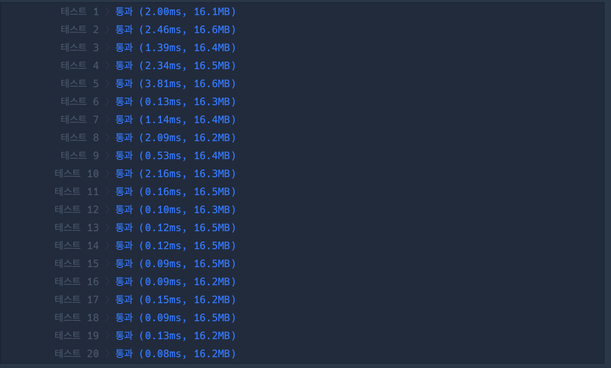

## 1. 문제

`프로그래머스`

[고득점 Kit 디스크 컨트롤러](https://school.programmers.co.kr/learn/courses/30/lessons/42627)


<br/>

## 2. 핵심 아이디어

`정렬`, `SFJ` (최소 작업 우선 스케줄링)

<br/>

## 3. 코드

[swift] `정렬`
```swift
func solution(_ jobs:[[Int]]) -> Int {
    var now = 0
    var totalTime = 0
    var sortedJobs = jobs.sorted(by: { ($0[1], $0[0]) < ($1[1], $1[0])})
    
    while !sortedJobs.isEmpty {
        var isRemoved = false
        for i in 0..<sortedJobs.count {
            if sortedJobs[i][0] <= now {
                now += sortedJobs[i][1]
                totalTime += now - sortedJobs[i][0]
                sortedJobs.remove(at: i)
                isRemoved = true
                break
            }
        }
        if !isRemoved {
            now += 1
        }
    }
    return totalTime / jobs.count
}
```

[swift] `Heap`
```swift
func solution(_ jobs:[[Int]]) -> Int {
    var now = 0
    var totalTime = 0
    var cJobs = jobs
    var sortedJobs = Heap (sort: { (lhs: [Int], rhs: [Int]) in
        return (lhs[1], lhs[0]) < (rhs[1], rhs[0])
    })
    while !cJobs.isEmpty || !sortedJobs.isEmpty {
        var tempJobs: [[Int]] = []
        for job in cJobs {
            if job[0] <= now {
                sortedJobs.insert(job)
            } else {
                tempJobs.append(job)
            }
        }
        cJobs = tempJobs
        if !sortedJobs.isEmpty {
            let job = sortedJobs.remove()!
            now += job[1]
            totalTime += now - job[0]
        } else {
            now += 1
        }
    }
    return totalTime / jobs.count
}

```

<br/>

## 4. 풀이 과정

처음에는 `완전 탐색`, `최소경로 탐색` 문제인줄 알았다..

그런데 문제의 요구사항과 제한사항을 만족하는 조건
- 요청부터 종료까지 걸린 시간의 최소
- 먼저 요청이 들어온 작업부터 처리

이 두가지를 만족 하려면 `그리디`와 같은 알고리즘으로,

- 현재 요청 시간을 만족하고 (작업을 시작할 수 있고)
- 그 중 가장 빨리 끝나는 작업

을 선택하며 작업을 수행하면 되었다.

<br/>

그런데 어떤식으로 처리할지 감이 안잡혀 [블로그](https://didu-story.tistory.com/323) 글을 참고했다.

그렇게 해서 위와 같이 `정렬`을 사용한 코드를 작성했는데, programmers 에서는 분류가 `heap` 으로 되어있어서 heap 으로 다시 풀어봤다.


|<center>heap<center/>|<center>sort<center/>|
| :---: | ---: | 
|||

그런데 sortedJobs 와 tempJobs 에 각각 append 하는 방식 때문인지, 시간이 오히려 더 걸렸다. tempJobs 를 없애고 구현을 할수도 있을 것 같은데... 한번 고민을 다시 해봐야겠다.

이런 상황을 보고 상황에 알맞은 자료구조를 쓰는게 정말 중요하다고 느꼈다. 

<br/>


```toc

```
