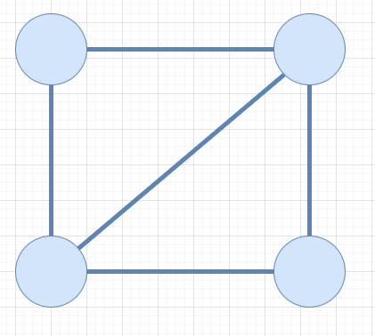
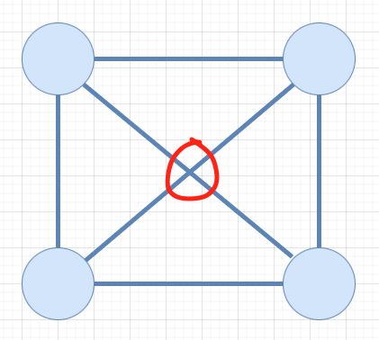

## 1. 문제

`프로그래머스`

[고득점 Kit 방의 개수](https://school.programmers.co.kr/learn/courses/30/lessons/49190)


<br/>

## 2. 핵심 아이디어

`그래프` `그리디`

<br/>

## 3. 코드

```swift
import Foundation

struct Point: Hashable {
    let y: Int
    let x: Int
}

struct Route: Hashable {
    let from: Point
    let to: Point
}

func solution(_ arrows:[Int]) -> Int {
    var answer = 0
    // y, x 이동 좌표
    let move = [(-1, 0), (-1, 1), (0, 1), (1, 1), (1, 0), (1, -1), (0, -1), (-1, -1)]
    var isVisited: [Point : Bool] = [:]
    var isVisitedDirection: [Route: Bool] = [:]
    
    var now = Point(y: 0, x: 0)
    isVisited[now] = true
    arrows.forEach { arrow in
        for _ in 0..<2 {
            let next = Point(y: now.y + move[arrow].0, x: now.x + move[arrow].1)
            if isVisited[next] == true {
                if isVisitedDirection[Route(from: now, to: next)] == nil {
                    answer += 1
                }
            } else {
                isVisited[next] = true
            }
            isVisitedDirection[Route(from: now, to: next)] = true
            isVisitedDirection[Route(from: next, to: now)] = true
            now = next
        }
    }
    return answer
}
```

<br/>

## 4. 풀이 과정

우선 문제를 보고 다음과 같이 생각했다.

    대각선의 움직임을 나타내기 위해 움직임을 2배로 만들기?
    여러방이 있는지 어떻게 확인하는가?
    방이 만들어지는 조건: 지나왔던 좌표를 또 방문했을때
    -> 1. 넓게 어떠한 도형으로 만들어 져서 도착했을때
    -> 2. 대각선으로 와서 세모의 형태로 만들어 졌을때

<br/>

대각선의 움직임을 나타내기 위해서 좌표계를 2배로 그리는 것은 [아이템 줍기](https://gobanest.com/algorithm/programmers/아이템%20줍기/) 문제에서 아이디어를 떠올렸다.

대각선을 표시하는 이유는 다음과 같다.

<br/>

|

<br/>

그림에서처럼 네모안에 하나의 대각선이 가로질러 2개의 방이 있는 상태를 가정해보자.

<br/>

|

<br/>

그 다음 대각선을 다른 대각선이 가로지르는 경우, 좌표계에서 따로 표시할 수 없으므로 해당 대각선에서 교차한다는 사실을 알기 어렵다.

하지만 좌표계를 2배로 만든다면, 대각선의 중간에 노드가 생겨서 쉽게 대각선의 교차를 확인할 수 있다.

<br/>

그 다음 방이 만들어지는 조건은 `현재 노드에서 기존에 방문했던 노드를 다시 방문했을때` 이다. 

때문에 현재 노드와 방문할 다음 노드 두개 모두 필요하고, 이 둘의 경로를 추적하는 것이 필요하다.

(중복되는 경로로 방의 개수가 중복 카운팅 되는 것을 막기 위함)

<br/>

그리고 이러한 아이디어를 종합해서 코드를 짜면 된다. (이틀 걸림ㅋㅋ)

<br/>

코드에서 Point와 Route 구조체를 만들지 않고 그냥 tuple로 문제를 풀려했는데,

Swift에서는 dictionary에 tuple을 이용할 수 없었다.

찾아보니 hashable로 사용할 수 있게 만드는 논의를 [이곳](https://forums.swift.org/t/synthesizing-equatable-hashable-and-comparable-for-tuple-types/7111) 에서 확인할 수 있는데, Swift 코어 개발자들이 구현의 복잡성과 컴파일 시간에 대한 우려로 반대해서 무산된듯하다.

🥲


<br/>

근데 구조체를 만들어서 사용하니 더 가독성이 오른 것 같다. 오히려 좋아?

애플의 큰뜻을 또 한번 느낀다...


```toc

```
