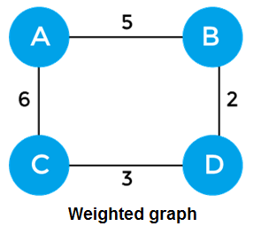
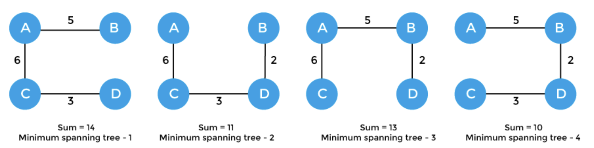

## 1. 문제

`프로그래머스`

[고득점 Kit 섬 연결하기](https://school.programmers.co.kr/learn/courses/30/lessons/42861)


<br/>

## 2. 핵심 아이디어

`그리디` `크루스칼`

<br/>

## 3. 코드

```swift
import Foundation

var parentNumber: [Int] = []

func solution(_ n:Int, _ costs:[[Int]]) -> Int {
    parentNumber = (0..<n).map{$0}
    let costs = costs.sorted { lhs, rhs in
        return lhs[2] <= rhs[2]
    }
    var sum = 0
    for bridge in costs {
        if !isCycle(left: bridge[0], right: bridge[1]) {
            changeParent(oldParent: parentNumber[bridge[1]], newParent: parentNumber[bridge[0]])
            sum += bridge[2]
        }
    }
    return sum
}

func isCycle(left:Int, right:Int) -> Bool {
    return parentNumber[left] == parentNumber[right]
}

func changeParent(oldParent:Int,newParent:Int) {
    parentNumber.indices.filter {parentNumber[$0] == oldParent}.forEach{parentNumber[$0] = newParent}
}
```

<br/>

## 4. 풀이 과정

    최단 경로를 우선 탐색하면 되지 않을까?
    1. 노드 하나 선택 -> DFS 로 연결된 방문하지 않은 다른 2. 노드 까지의 방문 거리를 업데이트 (최소 거리)
    3. 가장 짧은 거리의 노드로 이동.
    4. 반복
    -> 이게 다익스트라인가?

결론은 다익스트라 같은 알고리즘을 쓰면 될 것 같은데? 라는 생각을 가지게 되었고, 찾아봤는데..

`크루스칼` 이라는 비슷하면서 많이 다른 알고리즘이 이 문제 풀이에 더 맞다는 것을 알게되었다.

<br/>

### 크루스칼 알고리즘 이란?

크루스칼 알고리즘은 `최소 신장 트리`를 찾기위해 고안된 알고리즘이다.

이 알고리즘에서는 `오름차순 정렬` 과 `Union & Find` 가 활용된다.

### 최소 신장 트리

우선 `신장 트리 (spanning-tree)` 란 

    1. 모든 정점을 포함한다.
    2. 정점 간 서로 연결되고 싸이클이 존재하지 않는다.

이 두가지 조건을 만족하는 그래프이다.

<br/>



이와 같이 모든 정점이 연결되어 있고 가중치가 있는 그래프가 있다면

<br/>



이렇게 4가지의 신장 트리가 만들어질 수 있다.

이중에 `최소 신장 트리`는 간선의 가중치의 합이 가장 적은 4번째 신장 트리이다.

<br/>

### 구현

크루스칼 알고리즘에서는 먼저 `가중치의 오름차순으로 정렬`한 후, 정렬된 순서대로 간선을 추가한다.

간선을 추가하는 과정에서 `Union & Find`가 활용되는데, 서로 중복되지 않는 집합을 표현하기 위해 사용된다.

<br/>

구체적인 동작 과정은 [이곳](https://chanhuiseok.github.io/posts/algo-33/)을 참고하면된다.

구현의 핵심 아이디어는 요약하자면 최소 가중치 순차 추가, Union & Find 로 싸이클 여부 확인이다.

<br/>
<br/>

다익스트라와 크루스칼 알고리즘의 차이점은 조건이라고 생각한다.

다익스트라는 특정한 두개의 정점의 최소 거리를 찾을 때 사용하고

크루스칼은 모든 정점이 연결되기 위한 (사이클 없이) 최소 비용을 찾을 때 사용하면 좋다.

<br/>


## 참고

크루스칼의 구현과 설명을 [이곳](https://fomaios.tistory.com/entry/프로그래머스-섬-연결하기-Swift)에서 참조하였다.

<br/>


```toc

```
