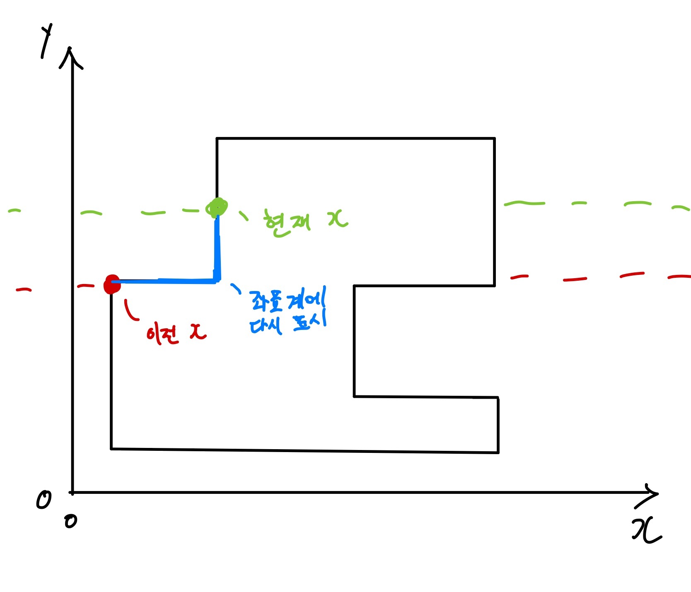
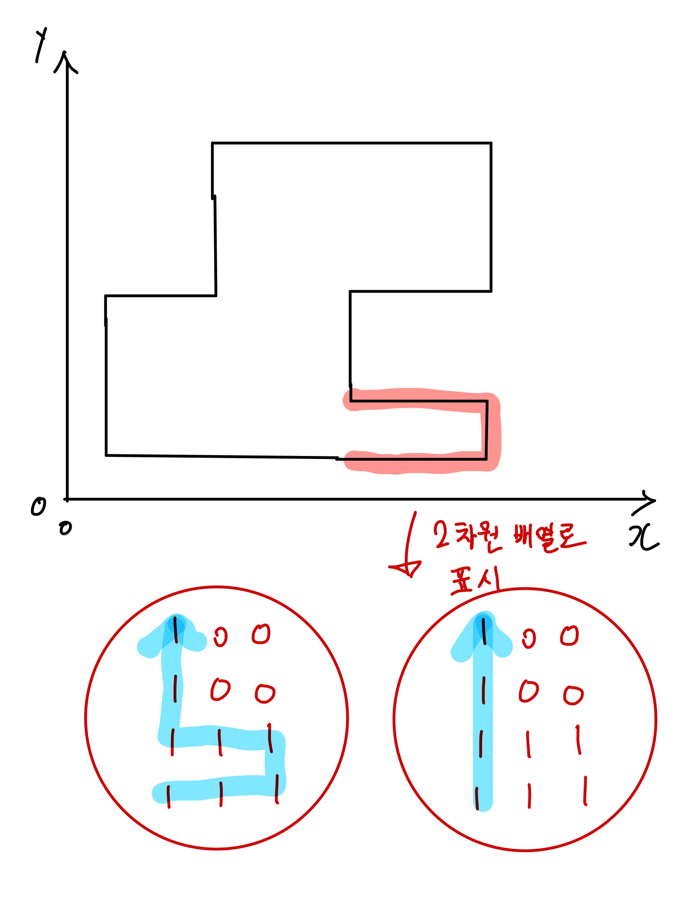

## 1. 문제

`프로그래머스`

[고득점 Kit 아이템 줍기](https://school.programmers.co.kr/learn/courses/30/lessons/87694?language=python3)


<br/>

## 2. 핵심 아이디어

`BFS`

<br/>

## 3. 코드

[swift]
```swift

import Foundation

func solution(_ rectangle: [[Int]], _ characterX:Int, characterY:Int, itemX: Int, itemY: Int) -> Int {
    var answer = 0
    var field = Array(repeating: Array(repeating: -1, count: 102), count: 102)
    
    for r in rectangle {
        let coordinates = r.map{ $0*2 }
        let x1 = coordinates[0]
        let y1 = coordinates[1]
        let x2 = coordinates[2]
        let y2 = coordinates[3]
        
        for i in y1...y2 {
            for j in x1...x2 {
                if x1 < j && j < x2 && y1 < i && i < y2 {
                    field[i][j] = 0
                } else if field[i][j] != 0 {
                    field[i][j] = 1
                }
            }
        }
    }
    let dx: [Int] = [-1, 1, 0, 0]
    let dy: [Int] = [0, 0, -1, 1]
    
    var stack: [(Int, Int)] = []
    stack.append((characterX * 2, characterY * 2))
    var visited = Array(repeating: Array(repeating: 1, count: 102), count: 102)
    
    while !stack.isEmpty {
        let (x, y) = stack.removeFirst()
        if x == itemX * 2 && y == itemY * 2 {
            answer = visited[y][x] / 2
            break
        }
        for k in 0..<4 {
            let nx = x + dx[k]
            let ny = y + dy[k]
            if field[ny][nx] == 1 && visited[ny][nx] == 1 {
                stack.append((nx, ny))
                visited[ny][nx] = visited[y][x] + 1
            }
        }
    }
    return answer
}

```

<br/>

## 4. 풀이 과정

처음에는 조금 무식한 방법을 생각했다.

    1. 주어진 사각형을 좌표계에 다 채워 놓고
    2. 아래서 위로 쌓는 느낌으로, x축 좌표계 라인을 순회한다.
    3. 이전 x 좌표와 현재 x 좌표 (가장 왼쪽, 오른쪽에 있는 x 좌표) 를 비교하여 이어지는 x 좌표를 좌표계에 다시 1 을 더해서 그린다.

<br/>

그림으로 표현하자면 이렇다.



<br/>

이처럼 현재 x 와 이전 x 를 비교하며 좌표계에 다시 경로를 표시하는 느낌으로 코드를 작성하려 했는데, 너무 비효율적이고 구현의 복잡도가 올라갔다.

또한 엣지 케이스 또한 대응하기가 어려웠다.

<br/>



<br/>

이 그림과 같은 모양으로 꺾인 경로가 있다면, 2차원 배열로 나타냈을 떄 잘못된 경로로 탐색을 할 수 있다 (우측 배열)

이런 경우를 대응하지 못해서 인터넷에서 다른 방법을 찾아봤다.

[이곳](https://velog.io/@rlaalswn3282/프로그래머스-아이템-줍기)에서 풀이를 봤는데, 주요한 해결 방법은 다음과 같았다.

    1. 좌표계에서 네모의 테두리만 그리기
    2. 좌표를 *2 해서 그리기

<br/>

1번은 내가 뻘짓한게 무색할정도로 쉬운 해결 방법이였다ㅜ 난 뭘한걸까

2번은 보니까 아하! 했다. 이런 방법이 있구나..! 천재인가


<br/>


```toc

```
