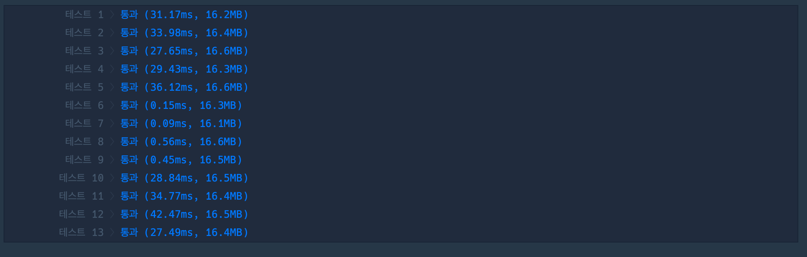
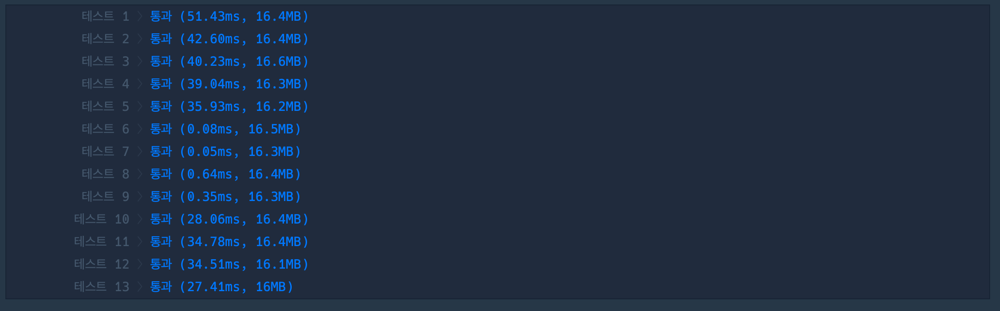
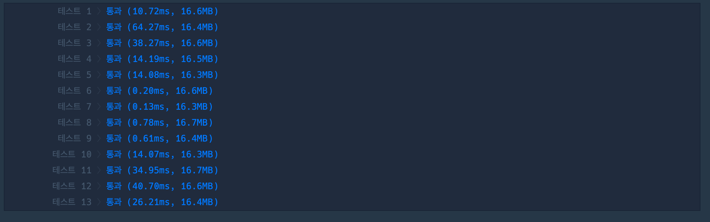

## 1. 문제

`프로그래머스`

[고득점 Kit 전력망을 둘로 나누기](https://school.programmers.co.kr/learn/courses/30/lessons/86971)


<br/>

## 2. 핵심 아이디어

`완전 탐색` `BFS` `DFS`

<br/>

## 3. 코드

[BFS]
```swift
func solution(_ n:Int, _ wires:[[Int]]) -> Int {
    var minDiff = 100
    func BFS(towerGraph: [[Bool]]) {
        var visited = Array(repeating: false, count: n + 1)
        var stack: [Int] = []
        stack.append(1)
        visited[1] = true
        while !stack.isEmpty {
            let checkPoint = stack.removeLast()
            for i in 1...n {
                if !visited[i] && towerGraph[checkPoint][i] {
                    visited[i] = true
                    stack.append(i)
                }
            }
        }
        let firstTowers = visited.filter{ $0 == true }.count
        let secondTowers = n - firstTowers
        let diff = abs(firstTowers - secondTowers)
        if diff < minDiff {
            minDiff = diff
        }
    }
    for i in 0..<wires.count {
        var cWires = wires
        cWires.remove(at: i)
        let towerGraphLine = Array(repeating: false, count: n + 1)
        var towerGraph: [[Bool]] = Array(repeating: towerGraphLine, count: n + 1)
        for wire in cWires {
            let startPoint = wire[0]
            let endPoint = wire[1]
            towerGraph[startPoint][endPoint] = true
            towerGraph[endPoint][startPoint] = true
        }
        BFS(towerGraph: towerGraph)
    }

    return minDiff
}
```

<br/>

[DFS]
```swift
func solution(_ n:Int, _ wires:[[Int]]) -> Int {
    var minDiff = 100
    func DFS(towerGraph: [[Bool]], lineIndex: Int, visited: inout [Bool], towerCount: inout Int) {
        for i in 1...n {
            if !visited[i] && towerGraph[lineIndex][i] {
                visited[i] = true
                towerCount += 1
                DFS(towerGraph: towerGraph, lineIndex: i, visited: &visited, towerCount: &towerCount)
            }
        }
    }
    for i in 0..<wires.count {
        var cWires = wires
        cWires.remove(at: i)
        let towerGraphLine = Array(repeating: false, count: n + 1)
        var towerGraph: [[Bool]] = Array(repeating: towerGraphLine, count: n + 1)
        for wire in cWires {
            let startPoint = wire[0]
            let endPoint = wire[1]
            towerGraph[startPoint][endPoint] = true
            towerGraph[endPoint][startPoint] = true
        }
        var visited = Array(repeating: false, count: n + 1)
        var towerCount = 0
        DFS(towerGraph: towerGraph, lineIndex: 1, visited: &visited, towerCount: &towerCount)
        let secondTowers = n - towerCount
        let diff = abs(towerCount - secondTowers)
        if diff < minDiff {
            minDiff = diff
        }
    }

    return minDiff
}
```

<br/>

## 4. 풀이 과정

문제를 보고 다음과 같이 생각하고, 구해야할 것을 생각했다.

    1. 전선을 하나 끊었을 떄 하나의 간선이 몇개 이어져있는지 확인
    2. 전체 송전탑 - 이어진 송전탑 = 또 다른 송전탑의 갯수
    3. 두개의 송전탑 개수의 차이 (절댓값)


그래서 생각했던 방식대로 전선을 끊고, 끊은 전선대로 graph를 만들어서 사용하였다.

<br/>

첫번째로 그래프를 탐색을 위해 사용한 방식은 `BFS` 인데, 스택을 사용하여 첫번째 타워에 연결된 노드의 개수를 구한 후, 전체 개수에 빼줬다.

이는 문제에서 송전탑이 전선을 통해 `하나의 트리` 형태를 이루고 있기 때문에 가능한 방식이였다.

<br/>

두번쨰로는 `DFS` 으로 재귀를 통해 구현하였다. 구현이 익숙치 않아, 조금 많이 버벅 거리고 코드가 깔끔하지 않다고 느꼈다. 하단에 다른 사람이 구현한 DFS 코드를 보고 아직 한참 멀었구나 느꼈다..!

<br/>


|<center>BFS<center/>|<center>DFS<center/>|
| :---: | ---: | 
|||

나의 코드에서는 BFS 가 조금 더 좋은 성능을 보여줬다. 

구현하기도 비교적 편하고, 더 익숙해서 그런지 코드를 읽기도 편한 느낌이다.

나는 완전탐색에서는 BFS 가 더 좋다..!

<br/>

## 5. 다른 사람의 코드

```swift
import Foundation

func solution(_ n:Int, _ wires:[[Int]]) -> Int {
    var connection = Array(repeating: Array(repeating: false, count: n+1), count: n+1)
    wires.forEach {
        connection[$0[0]][$0[1]] = true
        connection[$0[1]][$0[0]] = true
    }

    func countNodes(from root: Int, visited: [Bool]) -> Int {
        var count = 0
        var visited = visited

        func dfs(n: Int) {
            visited[n] = true
            count += 1
            connection[n].enumerated()
                .filter { $0.element == true && visited[$0.offset] == false }
                .forEach {
                    dfs(n: $0.offset)
                }
        }
        dfs(n: root)

        return count
    }

    // 임의의 노드에서, 그 노드포함해서 서브트리의 노드 개수를 구한다.
    var difference = Int.max
    var visited = Array(repeating: false, count: n+1)
    func travel(to node: Int) {
        visited[node] = true

        let subtreeA = countNodes(from: node, visited: visited)
        let subtreeB = n - subtreeA
        difference = min(difference, abs(subtreeA - subtreeB))


        connection[node].enumerated()
            .filter { $0.element == true && visited[$0.offset] == false }
            .forEach {
                travel(to: $0.offset)
            }
    }
    travel(to: 1)

    return difference
}

```

코드가 깔끔하고 읽기 좋아서 가져와봤다. 탐색을 위한 구조 (travel -> countNodes -> dfs) 도 깔끔하고 여러모로 본받을게 많은 코드였다.

특이한 점은 `enumerated` 를 잘 활용한 점이다.

저번에 내가 enumerated 를 지양하자고 썼는데, 이런식으로 곧바로 element와 offset을 활용하면 지양할 필요없고, 지향을 해도 될 것 같다.

많이 배웠다..!!

<br/>

|<center>other DFS<center/>|
| :---: |
||

시간초도 보면 테스트 케이스 2번 빼고는 우수한 속도를 보이는데, 아마 `graph`를 재생성 하지 않기 떄문에 조금 더 시간에 이점이 있는게 아닐까 생각한다.

<br/>


```toc

```
