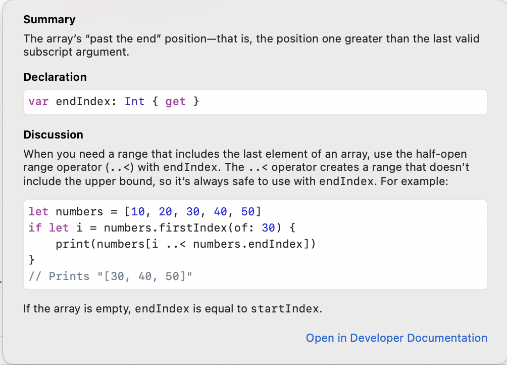

## 1. 문제

`프로그래머스`

[고득점 Kit 주식가격](https://school.programmers.co.kr/learn/courses/30/lessons/42584)


<br/>

## 2. 핵심 아이디어

`Queue` 를 이용한 반복문.

`startIndex`, `endIndex` 를 사용하여 배열 슬라이싱.

**주의: endIndex 는 실제 사용할 수 있는 Index + 1 을 반환함**

그래서 `..<` 와 같이 쓰라는데, 왜 이렇게 구현되었을까? 음..




<br/>

## 3. 코드

Python

```python
from collections import deque

def solution(prices):
    answer = []
    dPrice = deque(prices)
    while dPrice :
        price = dPrice.popleft()
        sec = 0
        for q in dPrice:
            sec += 1
            if price > q:
                break
        answer.append(sec)
    return answer

```

<br/>

Swift
```swift
func solution(prices: [Int]) -> [Int] {
    var answer: [Int] = []
    let dPrice: [Int] = prices
    var index = dPrice.startIndex
    let lastIndex = dPrice.endIndex
    while (index < lastIndex) {
        let price = dPrice[index]
        var sec = 0
        for q in dPrice[index + 1..<lastIndex] {
            sec += 1
            if price > q {
                break
            }
        }
        index += 1
        answer.append(sec)
    }
    return answer
}
```

Swift 에는 파이썬의 `Queue` 가 없어서 `startIndex`, `endIndex` 를 이용하여 배열 슬라이싱을 했다.

<br/>

## 4. 풀이 과정

일단 해당 문제에서 Swift 채점을 지원하지 않았기 떄문에, 파이썬으로 먼저 구현한 후 Swift 코드로 바꿨다.

```python
from collections import deque

def solution(prices):
    answer = [0] * len(prices)
    dPrice = deque([])
    for idx, price in enumerate(prices):
        dPrice.append((price, 0, idx))
        for _ in range(len(dPrice)):
            element = dPrice.popleft()
            newElement = (element[0], element[1] + 1, element[2])
            answer[newElement[2]] = element[1]
            if element[0] <= price:
                dPrice.append(newElement)
    return answer

```

answer 배열을 미리 만들어 놓고, 주식 가격을 deque 에 차례대로 넣어가며 반복문으로 가격을 검증 & answer 배열에 업데이트 하려고 했는데 해당 방식에서 비효율적인 삽입과 삭제가 일어났고, 시간초과를 초래했다.

그리고 길을 잃어서 어떻게 풀어야할지 감이 안잡혔다..

그래서 다른 사람의 코드를 참고했다. [참고 코드](https://velog.io/@soo5717/프로그래머스-주식가격-Python)를 바탕으로 상단의 풀이 코드가 작성되었다. 불필요한 삽입, 삭제 없이 훨씬 간소화 되었다.

문제를 보고 최적화 된 코드를 바로 생각하기란 어려운 것 같다. 아마 내가 구현에 급급하여 깊게 플로우를 정하지 않아서 생기는 문제가 아닐까 반성한다. 다음에는 문제를 풀떄

<strog>

1. 문제 해결에 필요한 플로우를 생각한다.
2. 해당 플로우에 적합한 자료구조, 알고리즘을 생각한다.
3. 추가적으로 필요한 변수를 생각한다.

</strong>
이렇게 코드를 작성하기 전에 생각을 한 후 풀어야겠다.

<br/>

## 5. 다른 사람의 코드

```python
def solution(prices):
    length = len(prices)
    
    # answer을 max값으로 초기화  
    answer = [ i for i in range (length - 1, -1, -1)]
    
    # 주식 가격이 떨어질 경우 찾기
    stack = [0]
    for i in range (1, length):
        while stack and prices[stack[-1]] > prices[i]:
            j = stack.pop()
            answer[j] = i - j
        stack.append(i)
    return answer

```


[이곳](https://velog.io/@soo5717/프로그래머스-주식가격-Python)에 있는 코드인데, stack 을 사용하여 필요할떄만 연산하는게 기발하고 좋은 방법이였다. 아주 창의적이야..


<br/>


```toc

```
