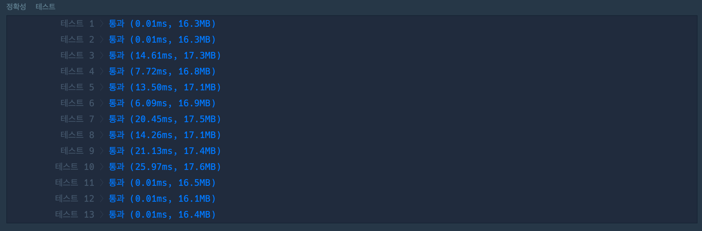
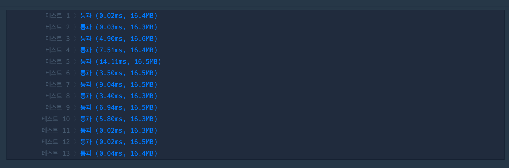

## 1. 문제

`프로그래머스`

[고득점 Kit 카펫](https://school.programmers.co.kr/learn/courses/30/lessons/42842)


<br/>

## 2. 핵심 아이디어

`완전탐색` `재귀` `stack`

<br/>

## 3. 코드

[재귀]
```swift
import Foundation

func solution(_ brown:Int, _ yellow:Int) -> [Int] {
    var answer: [Int] = []
    func searchCarpet(curBrown: Int, curYellow: Int, width: Int, height: Int) {
        if curBrown == brown && curYellow == yellow {
            answer = [width, height]
            return
        }
        if curBrown >= brown || curYellow >= yellow {
            return
        }
        searchCarpet(curBrown: curBrown + 2, curYellow: curYellow + height-2, width: width + 1, height: height)
        if width > height {
            for i in 1...width - height {
                if (curBrown + (2*i) == brown) && (curYellow + i*(width-2) == yellow) {
                    answer = [width, height + i]
                    return
                }
            }
        }
    }
    searchCarpet(curBrown: 8, curYellow: 1, width: 3, height: 3)
    return answer
}

```

<br/>

[stack]
```swift
struct Carpet {
    let brown: Int
    let yellow: Int
    let width: Int
    let height: Int
}

func solution(_ brown:Int, _ yellow:Int) -> [Int] {
    var answer: [Int] = []
    var searchStack: [Carpet] = []
    searchStack.append(Carpet(brown: 8, yellow: 1, width: 3, height: 3))
    
    while !searchStack.isEmpty {
        let carpet = searchStack.removeLast()
        if carpet.brown == brown, carpet.yellow == yellow {
            return [carpet.width, carpet.height]
        }
        if carpet.brown >= brown || carpet.yellow >= yellow {
            continue
        }
        if carpet.width > carpet.height {
            for i in 1...carpet.width - carpet.height {
                if (carpet.brown + (2*i) == brown) && (carpet.yellow + i*(carpet.width-2) == yellow){
                    return [carpet.width, carpet.height + i]
                }
            }
        }
        searchStack.append(Carpet(brown: carpet.brown + 2, yellow: carpet.yellow + carpet.height - 2, width: carpet.width + 1, height: carpet.height))
    }
    return answer
}
```

<br/>

## 4. 풀이 과정

처음에 문제를 어떻게 풀어야할지 감이 잘 안왔는데, **갈색 타일이 노란색 타일의 테두리 1열을 차지한다** 라는 문구에서 힌트를 얻어 규칙을 찾아냈다.

- 가로, 세로를 늘리는 동작을 반복하여 만족하는 brown, yellow의 갯수를 찾는다. <br/> (가로 >= 세로 일때 세로를 늘림)
    - 가로로 늘리는 동작: yellow + 1*(height-2), brown + 2
    - 세로로 늘리는 동작: yellow * n, brown + 2*n

이 규칙을 따라 가로로 타일을 늘려가면서 세로로 늘렸을때 경우를 체킹하면 될 것 같다고 생각하였고, 한번 `재귀`를 사용하여 문제를 풀어봤다.

<br/>

그 다음에 시간초 차이가 얼마나 나는지 궁금해서 stack 으로도 한번 풀어봤는데, 결과는 놀라웠다.

|<center>recursion<center/>|<center>stack<center/>|
| :---: | ---: | 
|||

숫자가 큰 테스트 케이스에서 5배 정도 시간차이가 벌어졌다.

아마도 재귀는 정답을 찾은 후에도 남아있는 재귀 method 를 계속 실행을 하기 떄문인 것 같다. 정말 어쩔 수 없는 경우가 아니면 stack or queue 를 써야겠다..!

<br/>


```toc

```
