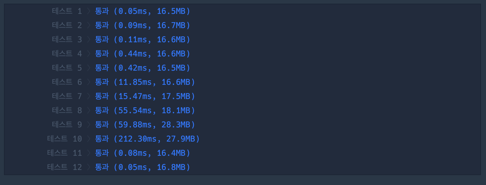

## 1. 문제

`프로그래머스`

[고득점 Kit 큰 수 만들기](https://school.programmers.co.kr/learn/courses/30/lessons/42883)


<br/>

## 2. 핵심 아이디어

`그리디`

<br/>

## 3. 코드

```swift
func solution(_ number:String, _ k:Int) -> String {
    let numberArray = Array(number)
    var pickCnt = k
    var stack: [Character] = []
    for i in 0..<numberArray.count {
        while !stack.isEmpty && pickCnt > 0 && stack.last!.wholeNumberValue! < numberArray[i].wholeNumberValue! {
            stack.removeLast()
            pickCnt -= 1
        }
        if stack.count < numberArray.count-k {
            stack.append(numberArray[i])
        }
    }
    return String(stack)
}
```

<br/>

## 4. 풀이 과정

처음의 생각은 다음과 같이 생각했다.

    number 의 개수 - k 만큼 뽑았을 때 가장 큰 수

제거할 개수말고 뽑을 개수를 기반으로 조합해서, DFS 로 모든 경우를 탐색하는 방법으로 문제를 풀려고 했다.

<br/>

[DFS]
```swift
func solution(_ number:String, _ k:Int) -> String {
    let numberArray = number.map{ String($0) }
    let pickNum = numberArray.count - k
    var maxNum = 0
    let visited = Array(repeating: false, count: numberArray.count)
    func DFS(perNumString: String, visited: [Bool], startIndex: Int) {
        if perNumString.count == pickNum {
            if let perNum = Int(perNumString) {
                maxNum = max(perNum, maxNum)
            }
            return
        }
        var cVisited = visited
        for i in startIndex..<numberArray.count {
            if !cVisited[i] {
                cVisited[i] = true
                let newString = perNumString + numberArray[i]
                DFS(perNumString: newString, visited: cVisited, startIndex: i)
            }
        }
    }
    DFS(perNumString: "", visited: visited, startIndex: 0)
    }
    return String(maxNum)
}
```

탐색을 일직선으로 (방문을 시작한 숫자의 전 숫자를 방문하지 않도록)

이렇게 visited 의 방문을 `true` 로만 설정하여서 구현하였다.

그런데 이 방법은 시간초과가 되었다ㅜ

<br/>

다른 방법으로 큐를 이용하여 BFS를 사용해서 풀어봤다.

```swift
func solution(_ number:String, _ k:Int) -> String {
    let numberArray = Array(number)
    var pickCnt = k
    var stack: [Character] = []
    for i in 0..<numberArray.count {
        while !stack.isEmpty && pickCnt > 0 && stack.last!.wholeNumberValue! < numberArray[i].wholeNumberValue! {
            stack.removeLast()
            pickCnt -= 1
        }
        if stack.count < numberArray.count-k {
            stack.append(numberArray[i])
        }
    }
    return String(stack)
}
```

그런데 모든 경우를 탐색하는 건 DFS BFS 모두 똑같아서, 여전히 시간초과였다.

어떻게 풀어야할지 감이 안잡혀서 [이곳](https://sio2whocode.tistory.com/m/182) 을 참고하였다.

<br/>

DFS를 풀고난 후 비슷한 생각을 했었는데, `다음 숫자로 이동하면서 배열에 있는 모든숫자를 선입선출 순서로 모두 꺼내고 비교해서 삭제해야하지 않나?` 라고 잘못생각하여 이 풀이까지 도달을 못했었다.🥲

매번 반복문의 실행마다 배열의 앞순서에 있는 숫자와 비교가 일어나고, 제거할 수 있는 카운트만큼 교체가 될 것이기 때문에 `선입선출의 순서`로 비교할 필요가 없었다.

<br/>

그리디 어렵다.. 문제의 상황에 대해 한층 더 깊게 생각하여 최적의 방법을 구현해내는게 어렵다.

연습을 하면서 감을 잡아야할듯하다.

<br/>

## 5. 다른 사람의 코드

```swift
import Foundation

func solution(_ number:String, _ k:Int) -> String {
    var answer = ""

    var _k:Int = k // k를 감소시키기 위해 변수로 선언
    let numbers:[Character] = Array(number) // swift 문자열은 서브스크립트를 제공하지 않기 때문에 편의상 배열로 변환
    let n:Int = numbers.count
    var stack:[Character] = []
    
    for (i,num) in numbers.enumerated() {
    	// 스택에서 값을 빼내는 반복문
        while !stack.isEmpty && _k > 0 && 
        stack.last!.wholeNumberValue! < num.wholeNumberValue! {
            stack.removeLast()
            _k -= 1
        }
        // 정해진 길이를 넘지 않는다면 stack에 append
        if stack.count < n-k {
            stack.append(num)
        }
    }
    return String(stack)
}
```

내가 참고한 코드인데, 이곳에서 enumerated 만 변경하였다.

|<center>Enumerated<center/>|<center>No Enumerated<center/>|
| :---: | ---: | 
|||

Enumerated 하나 차이인데 시간초가 아주 차이난다.

<br/>


```toc

```
