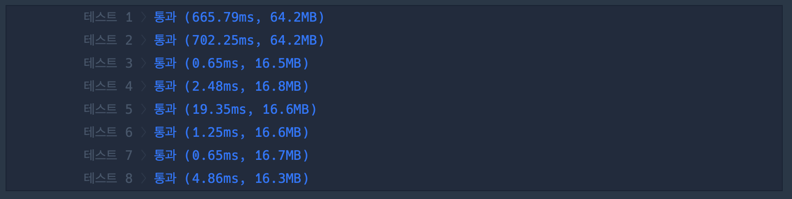
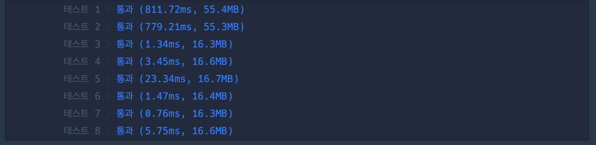
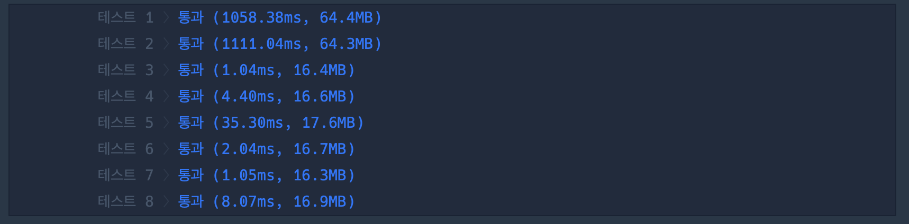

## 1. 문제

`프로그래머스`

[고득점 Kit 타겟 넘버](https://school.programmers.co.kr/learn/courses/30/lessons/43165)


<br/>

## 2. 핵심 아이디어

`DFS` `BFS`

<br/>

## 3. 코드

[DFS]
```swift
import Foundation

func solution(_ numbers:[Int], _ target:Int) -> Int {
    let n = numbers.count
    var answer = 0

    func DFS(num: Int, index: Int) {
        if index == n {
            if num == target {
                answer += 1
            }
            return
        }
        DFS(num: num + numbers[index], index: index + 1)
        DFS(num: num - numbers[index], index: index + 1)
    }
    DFS(num: 0, index: 0)

    return answer
}
```

<br/>

[BFS]

```swift
import Foundation

func solution(_ numbers:[Int], _ target:Int) -> Int {
    // LinkedQueue, DoubleStackQueue
    var queue = EffectiveQueue<(Int, Int)>()
    queue.enqueue((0,0))
    let n = numbers.count
    var answer = 0
    while !queue.isEmpty {
        let element = queue.dequeue()!
        let num = element.0
        let index = element.1
        if index == n {
            if num == target {
                answer += 1
            }
            continue
        }
        queue.enqueue((num + numbers[index], index + 1))
        queue.enqueue((num - numbers[index], index + 1))
    }
    return answer
}
```

<br/>

[EffectiveQueue](https://github.com/Gobans/Swift-Algorithm/blob/main/SwiftAlgorithm/DataStrcutre/EffectiveQueue.swift)

이 코드는 [이곳](https://one10004.tistory.com/247) 에서 작성된 코드입니다.

[LinkedQueue](https://github.com/Gobans/Swift-Algorithm/blob/main/SwiftAlgorithm/DataStrcutre/LinkedQueue.swift)

이 코드는 [이곳](https://nitinagam17.medium.com/data-structure-in-swift-queue-part-5-985601071606) 에서 작성된 코드입니다.

[DoubleStackQueue](https://github.com/Gobans/Swift-Algorithm/blob/main/SwiftAlgorithm/DataStrcutre/DoubleStackQueue.swift)

이 코드는 [이곳](https://trumanfromkorea.tistory.com/37) 에서 작성된 코드입니다.

<br/>

## 4. 풀이 과정

간단하게 숫자들을 DFS/BFS 로 탐색하는 코드를 구현하면 되는 문제였다.

나는 BFS로 문제를 먼저 풀었는데 시간초과가 났다..!

<br/>

그리고 나서 DFS로 풀었는데, 시간초과가 나지 않았다.

이상해서 왜인지 찾아봤는데..

<br/>

```swift
removeFirst()
```

이 명령어 때문이였다.

!!!!

나만 이 명령어 O(1)인줄 알고 있었나..

<br/>

무튼

다른 방식으로 구현된 queue를 사용해서 실행해보니 통과했다.

내가 써본 queue는 `EffectiveQueue`, `LinkedQueue`, `DoubleStackQueue`

인데 각각의 시간 효율이 달랐다.

<br/>

|<center>[EffectiveQueue](https://github.com/Gobans/Swift-Algorithm/blob/main/SwiftAlgorithm/DataStrcutre/EffectiveQueue.swift)<center/>|<center>[DoubleStackQueue](https://github.com/Gobans/Swift-Algorithm/blob/main/SwiftAlgorithm/DataStrcutre/DoubleStackQueue.swift)<center/>|<center>[LinkedQueue](https://github.com/Gobans/Swift-Algorithm/blob/main/SwiftAlgorithm/DataStrcutre/LinkedQueue.swift)<center/>|
| :---: | ---: | ---: | 
||||

EffectiveQueue > LinkedQueue > DoubleStackQueue 순으로 빨랐는데 그 이유는 각각 다음과 같다고 생각한다.

<br/>

    1. LinkedQueue: enqueue 마다 Node를 만들기 때문에 메모리 할당이 계속 일어난다. 이 떄문에 시간이 느려진다.
    2. DoubleStackQueue: inbox -> outbox로 옮겨갈 때 새롭게 메모리가 할당되면서 느려진다.
    3. EffectiveQueue: 메모리 공간 확보를 위해 removeFirst() 메소드를 사용하지만, head를 움직여서 값을 반환하기 때문에 dequeue() 메소드에서 새로운 메모리 할당이 필요없다.

<br/>

그런데 메모리 할당이 이렇게 시간차이를 많이 내나??

흠..

어쨌든.. node가 매번 탐색마다 많이 증가한다면 `removeFirst()` 사용은 지양해야겠다.

<br/>


```toc

```
