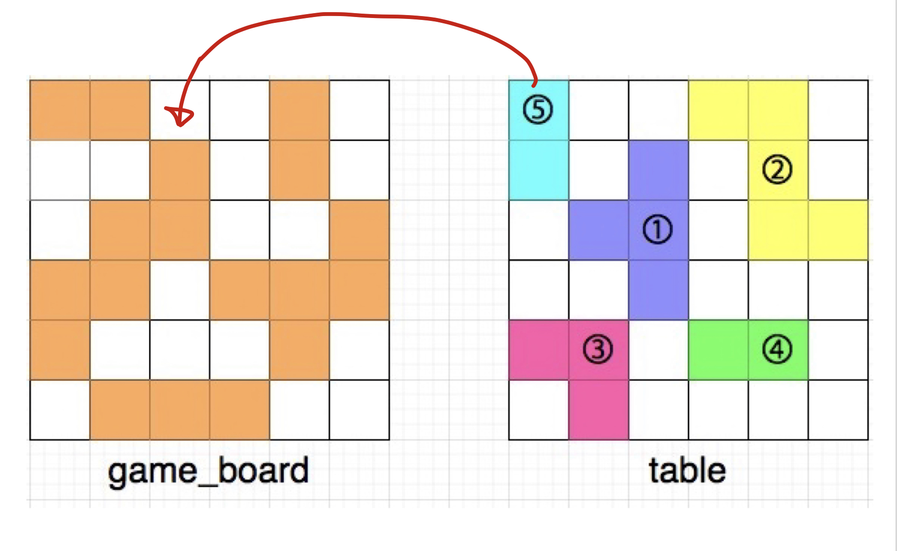
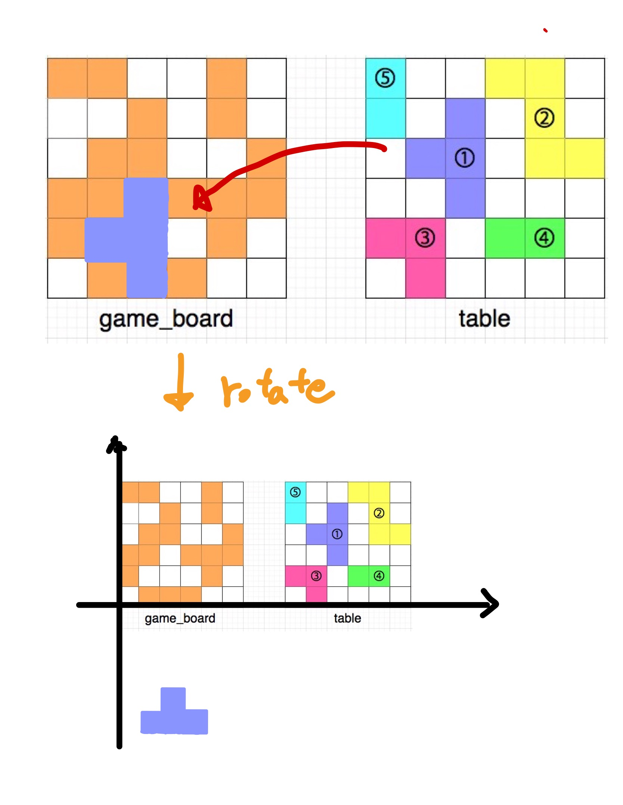

## 1. 문제

`프로그래머스`

[고득점 Kit 퍼즐 조각 채우기](https://school.programmers.co.kr/learn/courses/30/lessons/84021)


<br/>

## 2. 핵심 아이디어

`DFS` `정렬`

<br/>

## 3. 코드

```swift
import Foundation

func solution(_ game_board:[[Int]], _ table:[[Int]]) -> Int {
    
    var answer = 0
    
    // make table pices
    var cTable = table
    var tablePices: [[(Int, Int)]] = []
    for i in 0..<cTable.count {
        for j in 0..<cTable.count {
            if cTable[i][j] == 1 {
                tablePices.append(makePuzzlePice(x: j, y: i, board: &cTable, type: .table))
            }
        }
    }
    // matching pices
    var isVisitedPice = Array(repeating: false, count: tablePices.count)
    var gameBoard = game_board
    for i in 0..<gameBoard.count {
        for j in 0..<gameBoard.count {
            if gameBoard[i][j] == 0 {
                let gameBoardPice = makePuzzlePice(x: j, y: i, board: &gameBoard, type: .game)
                for (idx, tablePice) in tablePices.enumerated() {
                    if isVisitedPice[idx] {
                        continue
                    }
                    if checkEqualPice(gameBoardPice, tablePice) {
                        answer += tablePice.count
                        isVisitedPice[idx] = true
                        break
                    }
                }
            }
        }
    }
    
    return answer
}

enum BoardType {
    case game
    case table
}

let dy = [1, -1, 0, 0]
let dx = [0, 0, -1, 1]
func makePuzzlePice(x: Int, y:Int, board: inout [[Int]], type: BoardType) -> [(Int, Int)] {
    var pice: [(Int, Int)] = []
    var queue: [(Int, Int)] = []
    queue.append((x, y))
    pice.append((x, y))
    if type == .table {
        board[y][x] = 0
    } else {
        board[y][x] = 1
    }
    while !queue.isEmpty {
        let (x, y) = queue.removeFirst()
        
        for i in 0..<4 {
            let nx = x + dx[i]
            let ny = y + dy[i]
            if 0..<board.count ~= nx && 0..<board.count ~= ny {
                if type == .table {
                    if board[ny][nx] == 1 {
                        board[ny][nx] = 0
                        pice.append((nx, ny))
                        queue.append((nx, ny))
                    }
                } else {
                    if board[ny][nx] == 0 {
                        board[ny][nx] = 1
                        pice.append((nx, ny))
                        queue.append((nx, ny))
                    }
                }
            }
        }
    }
    return pice
}

func rotatePice(pice: inout [(Int, Int)]) {
    pice = pice.map{ ($0.1, -$0.0)}
}

func checkEqualPice(_ pice1: [(Int, Int)], _ pice2: [(Int, Int)]) -> Bool {
    var pice1 = pice1
    var pice2 = pice2
    if pice1.count != pice2.count {
        return false
    }
    pice1.sort{ $0.0 == $1.0 ? $0.1 < $1.1 : $0.0 < $1.0 }
    pice2.sort{ $0.0 == $1.0 ? $0.1 < $1.1 : $0.0 < $1.0 }
    
    for _ in 0...3 {
        // adjust pice coordinate
        let diffX = abs(pice1[0].0 - pice2[0].0)
        let diffY = abs(pice1[0].1 - pice2[0].1)
        let adjustX = pice1[0].0 < pice2[0].0 ? -diffX : diffX
        let adjustY = pice1[0].1 < pice2[0].1 ? -diffY : diffY
        pice2 = pice2.map { ($0 + adjustX, $1 + adjustY)}
        pice2.sort{ $0.0 == $1.0 ? $0.1 < $1.1 : $0.0 < $1.0 }
        
        // check is equal pice
        var isExistEqualPice = true
        for i in 0..<pice1.count {
            if pice1[i] != pice2[i] {
                isExistEqualPice = false
                break
            }
        }
        if isExistEqualPice {
            return true
        }
        rotatePice(pice: &pice2)
        pice2.sort{ $0.0 == $1.0 ? $0.1 < $1.1 : $0.0 < $1.0 }
    }
    return false
}
```

<br/>

## 4. 풀이 과정

정말 어려웠고 시간이 많이 소요된 문제이다..!

하나씩 정리하며 되짚어 보자.

<br/>

### 전체적인 코드 흐름

우선 퍼즐을 맞추는 문제는 이전에 한번 풀어본적이 있어서, 퍼즐 조각의 4가지 형태 (90º 씩 회전한 형태)를 비교해서 퍼즐을 맞춰야한다는 아이디어를 생각해냈다.

그리고 이 퍼즐조각을 나타내는 형태는 좌표계들의 집합으로 설정하였고. game_board, table 을 BFS로 탐색하여 퍼즐 조각을 추출해냈다.

- 코드의 make table pices 부분에서 보면 table 에 있는 퍼즐 조각들을 먼저 추출해서 담았다. 이를 사용해서 game_board의 빈칸에 하나씩 비교하며 채워넣어 줄 것이다.
- 보드에서 퍼즐 조각을 추출하는 코드는 makePuzzlePice 함수가 담당하였다.

<br/>

그리고 나서 game_board를 탐색하며 빈 퍼즐 조각을 추출하며 보드판을 채워주었다.

-  코드의 matching pices 부분 참조.

추출한 조각을 곧바로 이전에 추출했던 퍼즐조각과 비교하여 퍼즐이 들어맞는지 확인하였다. 

- 코드의 checkEqualPice 함수.

<br/>

### 어려웠던 부분

퍼즐 조각을 좌표의 형태로 추출하여 해당 조각을 회전 시킨다는 아이디어는 곧잘 떠올렸는데, 문제는 **서로 다른 위치에 있는 퍼즐 조각의 좌표를 어떻게 맞춰야하는가**였다.

<br/>



<br/>

그림에서처럼 table의 퍼즐 조각을 game_board의 빈 공간에 들어맞는지 비교하면서 확인해야했다. 

이 문제에 대한 좋은 아이디어는 `정렬`이였다. 

좌표의 집합을 두 곳 모두 일정한 기준으로 정렬해놓고, **시작점**의 좌표 차이를 비교해서 하나의 전체 좌표 집합에 차이를 더해주면 두 퍼즐 조각의 **시작점**을 맞춰줄 수 있다.

- adjust pice coordinate 부분 참조

<br/>

그런데 주의할점은 정렬이 일어나는 타이밍이다. 퍼즐 조각의 비교 과정에서 정렬의 타이밍은 다음과 같다.

    1. 좌표 차이를 비교하기 전 (기준점을 잡아야하기 떄문에)
    2. 좌표 차이를 비교한 후 차이를 더해줬을 떄 (바뀐 좌표값들이 정렬 기준에 맞도록 다시 정렬 해줘야한다)

<br/>

나는 처음에 좌표 차이를 한번 비교해서 맞춰주면, 그 다음부터는 맞춰진 상태 그대로 퍼즐 조각을 회전하면 되지 않을까 생각했는데, 이는 잘못된 생각이였다.

왜냐하면 퍼즐을 회전시키는 공식 (x,y) -> (y,-x) 때문에 퍼즐의 좌표계가 저 멀리 가버리기 때문이다.

<br/>



<br/>

그래서 퍼즐을 회전시키고 정렬 후 기준점을 다시 맞춰줘야한다.

<br/>


```toc

```
