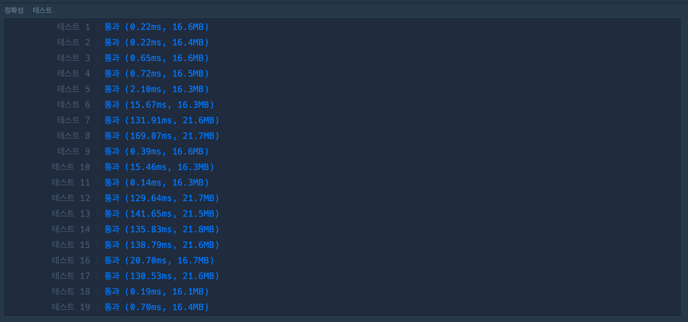
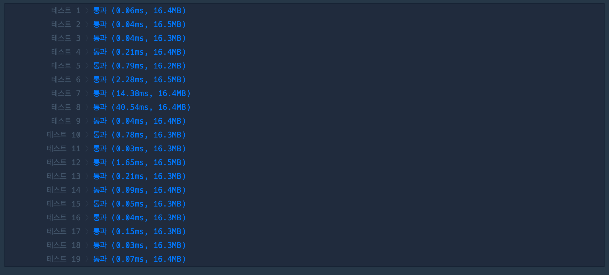

## 1. 문제

`프로그래머스`

[고득점 Kit 피로도](https://school.programmers.co.kr/learn/courses/30/lessons/87946)


<br/>

## 2. 핵심 아이디어

`완전탐색` `순열` `DFS` 

<br/>

## 3. 코드

[순열]
```swift
import Foundation

func solution(_ k:Int, _ dungeons:[[Int]]) -> Int {
    let dungeonPermutaion = permutation(dungeons, dungeons.count)
    var maxEnterTimes = 0
    for dungeonList in dungeonPermutaion {
        var userFatigue = k
        var enterTimes = 0
        for dungeon in dungeonList {
            let enterFatigue = dungeon[0]
            let consumeFatigue = dungeon[1]
            if userFatigue >= enterFatigue {
                userFatigue -= consumeFatigue
                enterTimes += 1
            }
        }
        if enterTimes > maxEnterTimes {
            maxEnterTimes = enterTimes
        }
    }
    return maxEnterTimes
}

```

[DFS]
```swift
import Foundation

func solution(_ k:Int, _ dungeons:[[Int]]) -> Int {
    let visited = Array(repeating: false, count: dungeons.count)
    var maxDepth = 0
    func DFS(visited: [Bool], fatigue: Int, depth: Int) {
        if depth > maxDepth {
            maxDepth = depth
        }
        for i in 0..<dungeons.count {
            let enterFatigue = dungeons[i][0]
            let consumeFatigue = dungeons[i][1]
            if !visited[i] && fatigue >= enterFatigue {
                var cVisited = visited
                cVisited[i] = true
                DFS(visited: cVisited, fatigue: fatigue - consumeFatigue, depth: depth + 1)
            }
        }
    }
    DFS(visited: visited, fatigue: k, depth: 0)
    return maxDepth
}
```

<br/>

## 4. 풀이 과정

처음에는 다음과 같이 생각하여 정리하였다.

필요사항:

     최소 필요 피로도: 던전 탐험을 위한 피로도
     소모 피로도: 던전 탐험 후 소모되는 피로도
     유저가 탐험할 수 있는 최대 던전 수

- 우선 시 되는 것: 소모 피로도가 낮은 것.
    - 소모 피로도 1순위, 최소 필요 피로도 2순위로 정렬.
    - 선택을 해나가면서 가능한 던전 탐색.

이런식으로 정렬을 사용해서 문제를 풀면 어떨까 생각을 했었는데,

생각해보니 이렇게 풀면 던전을 방문하는 `순서`를 커버할 수가 없어서, 틀리게 된다.

<br/>

그래서 `순열`로 던전에 방문하는 모든 순서를 구해서 탐색하는 것을 생각했고, 해당 코드가 위에 있다.

그런데 이렇게 풀면 모든 경우의 수를 다 탐색을 하는거라 상당히 비효율적 일 것이라 생각했다.

그래서 `DFS` 로 다시 한번 풀어보고 테스트 했다. 

|<center>순열<center/>|<center>DFS<center/>|
| :---: | ---: | 
|||

차이가 엄청나다!!

순열은 정말 어쩔 수 없을 때 사용하자..

<br/>

그리고 또 하나 발견한 것이 `enumerated` 에 관한 것인데,

애가 엄청난 시간을 잡아먹는다는 것을 이번에 발견했다.

|<center>DFS Enumerated<center/>|<center>DFS<center/>|
| :---: | ---: | 
|||

보다시피 테스트 8번에서 134 -> 40 이라는 엄청난 차이가 있다.

왜냐하면 Enumerated 메소드가 for 문으로 탐색하는 원소를 맵핑 하여 i 를 생성하기 때문에 `O(N)` 의 시간을 가진다고 한다..

Enumerated 알고리즘 풀때 지양하자.

<br/>

이걸 어떻게 알게 됐냐면, 다른사람 코드를 테스트 해보면서 실행속도를 봤는데 나와 차이가 많이 나서 뭔가 싶어서 봤더니 Enumerated 차이가 있었던 것을 발견했다.

운좋게 이 사실을 알게되었다!


<br/>


```toc

```