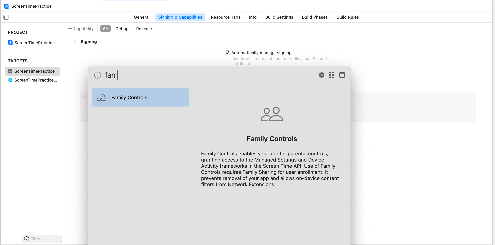
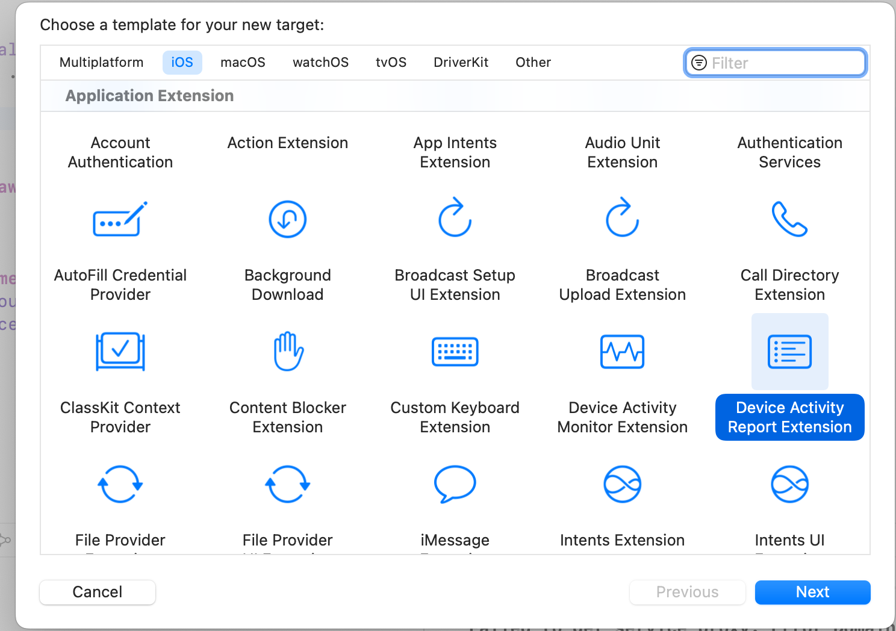

## ScreenTime API

WWDC21 에서 ScreenTime API 가 처음으로 등장했다.

[Meet the Screen Time API](https://developer.apple.com/videos/play/wwdc2021/10123/)

ScreenTime API 는 요약하자면 사용자의 Device (아이들) 내부의 앱 실행을 제어하는데 사용할 수 있는 API 이다.

<br/>

그 후 WWDC22 에서 조금 기능이 추가되고 확장되었다.

원래 아이들의 Device를 제어하는 것에 한정된 Family Controls가 개인의 Device를 제어할 수 있도록 기능이 확장되었고, Device Activity로 사용자가 사용한 앱들의 정보를 불러올 수 있게 되었다.

이번 포스팅에서는 Device Activity를 이용하여 사용자가 사용한 앱들의 정보를 불러오는 방법에 대해서 소개하겠다.


<br/>

## 기본 셋팅

Device Activity에 사용되는 view는 SwiftUI로 구성되어있다.

SwiftUI로 프로젝트를 만들어주자.

<br/>

프로젝트를 만든 후 family controls에 대한 권한을 추가해야한다.

<br/>



Target에 Signing & Capablities를 추가하자.

<br/>

그 다음 권한을 요청하는 코드를 앱 실행시에 넣어주자

```swift
import FamilyControls
import DeviceActivity

AuthorizationCenter.shared.requestAuthorization(for: .individual)
```

<br/>

이제 DeviceActivityReportExtension 을 추가해줘야한다.

해당 기능은 샌드박스화 되어 사용되기 떄문에 자체적인 target에 코드를 추가하여 사용할 수 없고 extension으로 또 다른 타겟으로 추가해줘야한다.

<br/>



<br/>

xcode의 상단 (File -> New -> Target) 으로 target template을 선택하여 추가할 수 있다.

DeviceActivityReportExtension을 선택하여 추가해주자.

<br/>

그러면 DeviceActivityReport를 사용할 수 있는 기본 템플릿을 자동으로 생성해준다.

해당 템플릿에 주석으로 설명이 잘 써져있으니 참고해서 커스텀하면 된다.

<br/>

다시 원래 프로젝트로 돌아가서, DeviceActivityReport View를 띄워보자.

<br/>

```swift
import SwiftUI
import FamilyControls
import DeviceActivity

@main
struct ScreenTimePracticeApp: App {
    
    @State private var context: DeviceActivityReport.Context = .totalActivity
    @State private var filter = DeviceActivityFilter(
        segment: .daily(
            during: Calendar.current.dateInterval(
                of: .weekOfYear, for: .now
            )!
        ),
        users: .all,
        devices: .init([.iPhone, .iPad])
    )
    
    init() {
        Task{
            try await AuthorizationCenter.shared.requestAuthorization(for: .individual)
        }
    }
    
    var body: some Scene {
        WindowGroup {
            DeviceActivityReport(context, filter: filter)
        }
    }
}
```

<br/>

DeviceActivityReport에서는 `context`와 `filter`가 필요하다.

context는 우리가 DeviceActivityReportExtension을 추가하여 커스텀했던 view를 식별하기위해 사용된다.

filter는 DeviceActivityReportExtension에서 `makeConfiguration` 메소드 안에 받아오는 데이터(DeviceActivityResults<DeviceActivityData>)를 필터링 해주기위해 사용된다.

<br/>


여기까지가 DeviceActivityReport를 사용하기 위한 기본적인 셋팅이다.

<br/>


## 문제점과 대응방안

<br/>

### 데이터 버그?

사용자가 사용한 앱 데이터를 받아오는 부분은 `makeConfiguration` 메소드에 있다.

<br/>

```swift
 func makeConfiguration(representing data: DeviceActivityResults<DeviceActivityData>) async -> TotalActivityView.Configuration
```

<br/>

그런데 data를 받아서 보면 CategoryActivity의 localizedDisplayName이 항상 nil로 표시되는 버그가 있다.

https://developer.apple.com/forums/thread/709692

찾아보니 같은 이슈를 겪는 사람이 있다.

<br/>

떄문에 앱 카테고리를 특정하기 위해서는 [FamilyActivityPicker](https://developer.apple.com/documentation/familycontrols/familyactivitypicker)를 사용하여 report를 보기 전 카테고리를 지정해서, 해당 카테고리 데이터만 보여주는 것을 절충안으로 사용해야할 듯 하다.

<br/>

아니면 잘 모르지만 shield extension 에서는 카테고리 이름들을 받아올 수 있다고 하는데, 이걸 사용하는 것도 하나의 방법일 것 같다.

<br/>

### 디버그의 어려움

target으로 추가한 DeviceActivityReportExtension는 그냥 실행해서는 디버깅할 수 없다.

대신에 xcode 상단 (Debug -> Attach to process -> 해당 DeviceActivityReportExtension) 으로 디버깅 목록에 추가해주면 lldb로 디버깅할 수 있다.

```toc

```
