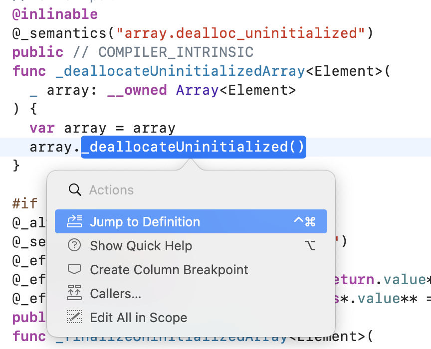

# 들어가면서

<br/>

Swift 는 open source 입니다.

아주 접근이 쉬운 혜자 언어죠.

<br/>


<center>그런데 말입니다. </center>

<br/>

이 오픈소스 코드를 웹상에서 뜯어보려면.. 정말 엄청 힘들고 사실상 불가능에 가깝다.

<br/>

특정한 자료구조, 기능이 궁금한데 하나의 메소드 안에서 다른 여러 메소들이 중첩으로 사용되고 있고.. 여러 프로토콜을 준수하고.. 프로토콜 메소드도 사용하고..

<br/> 

이걸 정말 하나하나 웹상에서 찾아가면서 혹은 로컬에서 해당 swift 파일을 열어서 뜯어보기란 불가능하다.

<br/>

그래서 이번 포스트에서 Swift 를 빌드하여 xcode로 열어 뜯어볼 수 있는 방법을 소개하고자 한다.

<br/>

# Swift 빌드

> macOS 기준 셋팅 방법임! <br/> 다른 OS 는 [이곳](https://github.com/apple/swift/blob/main/docs/HowToGuides/GettingStarted.md) 가이드를 참조해야함.

<br/>

Swift 는 여러 OS, Architecture 를 지원하고 있다. 그리고 여러 환경에 맞춰 빌드를 할 수 있도록 빌드 스크립트를 제공해준다.

다만 빌드에 필요한 Swift의 Dependency와 컴파일 툴은 직접 설치해야한다.

하나씩 해보자!

<br/>

## 준비물

1. python 3
2. Git 2.x
3. 디스크 용량 5GB ~ 70 GB (나는 빌드 후 65GB 사용중이다.)
4. 시간... 빌드하는데 20 ~ 30분 정도 걸림
5. CMake, Ninja

<br/>

이중 [CMake](https://cmake.org) 와 [Ninja](https://ninja-build.org) 는 아래와 같은 명령어로 설치 가능.

```
brew install cmake ninja
```

<br/>

> 만약 swift 오픈소스에 기여할 목적이라면 또 다르게 셋팅을 해줘야함. [이곳](https://github.com/apple/swift/blob/main/docs/HowToGuides/GettingStarted.md) 가이드를 참조.


<br/>

## 프로젝트 받기

<br/>

준비를 다 했으니 Swift와 필요한 Dependency들을 받아보자.

<br/>

```
mkdir swift-project
cd swift-project
```

적당한 곳에 swift-project 폴더를 만들고 들어가주자.

<br/>

```
git clone https://github.com/apple/swift.git swift
cd swift
utils/update-checkout --clone
```

그리고 swift를 클론한 후 `utils/update-checkout --clone` 명령어로 Dependency들을 클론해주자.

<br/>

그 후 

```
ls ..
```

명령어로 상위 폴더에 받아진 Dependency를 확인해보면

<br/>


이런식으로 많은 파일들이 받아진 것을 확인할 수 있다.

<br/>

그 다음

```
utils/build-script --skip-build-benchmarks \
  --skip-ios --skip-watchos --skip-tvos --swift-darwin-supported-archs "$(uname -m)" \
  --release-debuginfo --swift-disable-dead-stripping
```

이 명령어로 ToolChain 을 만들어주고

<br/>

```
utils/build-script --swift-darwin-supported-archs "$(uname -m)" --xcode --clean
```

이 명령어로 xcodeproj 파일을 생성할 수 있다.


<br/>

그 다음 swift-project 폴더안에 생성된 

build -> Xcode-MinSizeRelAssert -> swift-macosx-arm64 -> stlib 에서 xcodeproj를 열어주면 된다.

<br/>

그러면 이렇게 swift source 파일들을 볼 수 있다.


빨간색으로 되어있는 파일들은 .gyb 확장자를 가진 녀석들인데..

Swift team 에서 빌드 시 노가다를 줄이려고 이런 확장자를 사용한 것이라고 한다.

https://forums.swift.org/t/what-are-swift-gyb-files/303

<br/>

근데 얘는 빌드를 하는지 잘 모르겠다..

일단 깃헙에서 보는걸로..ㅜ

<br/>

아무튼 여기까지 했으면 이제 소스 파일들을 jump to definition 으로 뜯어볼 수 있다!!




👍👍👍👍

<br/>

# 디버그

추가로 Swift를 디버그하면서 테스팅을 하려면 추가적인 셋팅이 필요하다.

[이곳](https://github.com/apple/swift/blob/main/docs/HowToGuides/GettingStarted.md)에서 Using Ninja with Xcode 섹션에 **'Create an empty Xcode project in the workspace, using the External Build System template.'**
 이 파트부터 따라하면 된다.

<br/>

나는 일단 소스코드를 둘러보는 것이 목표였기에 이 정도로만 셋팅을 했다!

```toc

```
